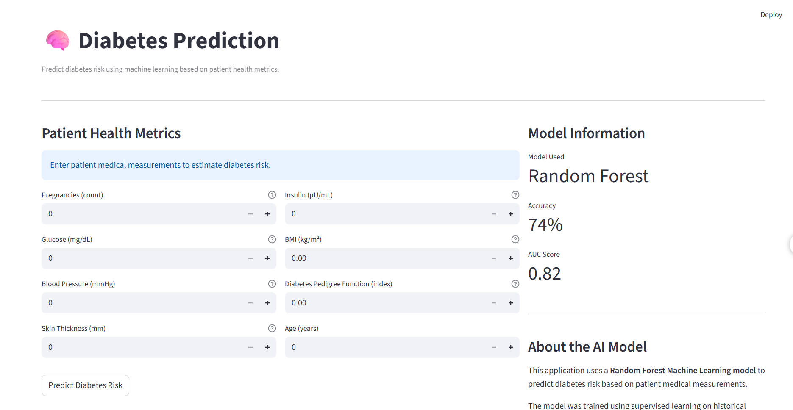

# 🧠 Diabetes Prediction AI

A machine learning web application that predicts the **risk of diabetes** using patient health metrics.  
The model analyzes medical indicators such as glucose level, BMI, insulin level, and age to estimate diabetes probability.

The application is deployed using **Streamlit** and built using **Python and Scikit-learn**.

---

# 🚀 Project Overview

Diabetes is a common chronic disease that can lead to serious health complications if not detected early.  
This project uses **machine learning classification models** to predict diabetes risk based on medical attributes.

The system takes patient measurements as input and outputs a **risk probability and risk level**.

---

# 📊 Dataset

Dataset used: **Pima Indians Diabetes Dataset**

Source:  
UCI Machine Learning Repository / Kaggle

Dataset characteristics:

- **768 patient records**
- **8 medical features**
- Binary target variable (Diabetes / No Diabetes)

Features:

| Feature | Description |
|------|------|
| Pregnancies | Number of pregnancies |
| Glucose | Plasma glucose concentration |
| BloodPressure | Diastolic blood pressure |
| SkinThickness | Triceps skin fold thickness |
| Insulin | 2-hour serum insulin |
| BMI | Body Mass Index |
| DiabetesPedigreeFunction | Genetic diabetes likelihood |
| Age | Age of patient |

Target variable:
Outcome
0 → No Diabetes
1 → Diabetes

---

# 🔍 Exploratory Data Analysis (EDA)

Key insights discovered during analysis:

- **Glucose level** has the strongest correlation with diabetes.
- **BMI and Age** also show strong influence.
- The dataset contains some **missing values represented as zeros**, which were cleaned during preprocessing.

Visualizations created:

- Outcome distribution
- Correlation heatmap
- Glucose vs diabetes outcome
- BMI vs diabetes outcome
- Feature importance chart

---

# 🧹 Data Preprocessing

The following preprocessing steps were performed:

- Replaced invalid **zero values** in medical columns with missing values
- Filled missing values using **median imputation**
- Split dataset into **training and testing sets**
- Feature scaling applied where required

---

# 🤖 Machine Learning Models

Multiple models were tested:

| Model | Purpose |
|------|------|
| Logistic Regression | Baseline linear model |
| Random Forest | Ensemble decision tree model |
| Gradient Boosting | Advanced boosting model |

The **best performing model** was selected based on **ROC-AUC score**.

Final model used:

Random Forest Classifier

---

# 📈 Model Performance

Evaluation metrics:

| Metric | Value |
|------|------|
Accuracy | ~74–78% |
ROC-AUC Score | ~0.82 |

These results indicate a strong ability to distinguish between diabetic and non-diabetic patients.

---

# 🖥️ Web Application

The trained model is deployed as an **interactive Streamlit dashboard**.

Users can enter patient health measurements and instantly receive:

- Diabetes risk probability
- Risk classification (Low / Moderate / High / Very High)

Example dashboard features:

- Medical input units
- Risk probability indicator
- Model information panel

---

# ⚙️ Tech Stack

Programming Language:

Python

Libraries Used:

Pandas
NumPy
Scikit-learn
Matplotlib
Seaborn
Streamlit
Joblib

---

# 📂 Project Structure

Diabetes-Prediction-Data-Science
│
├── datasets
│ └── diabetes.csv
│
├── notebooks
│ └── diabetes_analysis.ipynb
│
├── src
│ └── diabetes_model.pkl
│
├── app
│ └── streamlit_app.py
│
├── requirements.txt
└── README.md

---

# ▶️ How to Run

### 1 Install dependencies

pip install -r requirements.txt

### 2 Run the application

streamlit run app/streamlit_app.py

---

# 📸 Application Preview
## Dashboard Preview

---

# 👨‍💻 Author

Ravendra Choudhary

BTech – Electronics & Communication Engineering

Interested in:

- Artificial Intelligence
- Machine Learning
- Data Science

---

# ⭐ If you like this project

Please consider giving the repository a **star**.
